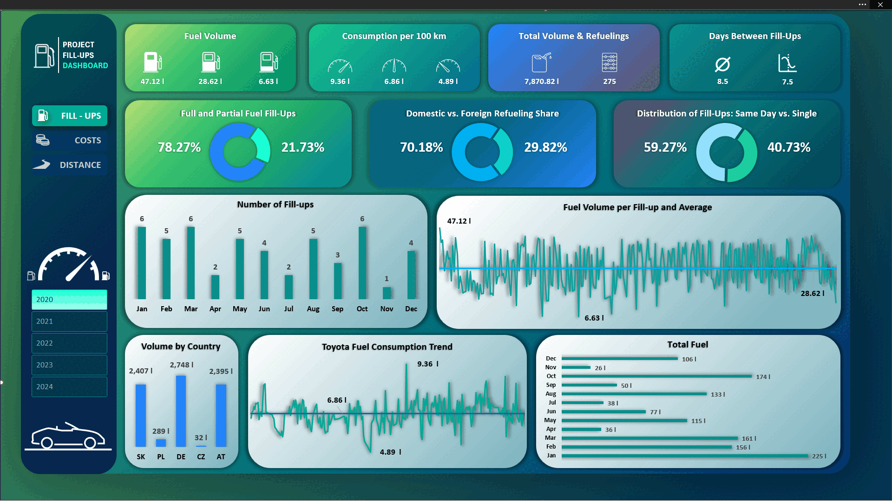

# Toyota Corolla – Fuel Dashboard (2020–2024)

**275 refuelings · 7,870.82 L · €12,071.78 · 114,620 km**

  <a href="Fuel_Analysis_Toyota_Corolla.xlsm">⬇️ Download the Excel dashboard (XLSM)</a>

  

An interactive Excel dashboard (with VBA) built from my refueling logs.  
I exported the data from the **Fuelio** app (PDF), converted it to a table with **Python**, cleaned it, and calculated real consumption between full fill‑ups. The results match the car’s onboard computer.

**Skills (used here):** Excel (Pivot Tables, charts), VBA (UI/navigation), Python (pandas ETL & interpolation)

## What it includes
- **Refuelings**, **Volume [L]**, **Costs [€]**, **Price €/L**, **€/km**, **Distance**, and time trends.
- Three views: **Refuelings**, **Costs**, **Distance** (switch on the left).
- Interactive year filters and quick KPI cards.

## How I built it
1. Export from Fuelio to **PDF** → conversion with **Python** to CSV/XLSX.
2. **Data cleaning** (dates, types, error fixes).
3. **Consumption calculation** – based on full fill‑ups, gaps estimated (interpolation).
4. Visualization in **Excel** (pivots, charts, dashboard) + a few **VBA** tweaks.

## Key findings
- The most expensive fuel over time in **Germany**; the cheapest in **Poland** and **Austria**.
- I had **more refuelings abroad**.
- There is a **weak negative correlation** between price per liter and consumption – when fuel is more expensive, I tend to drive more efficiently.
- Consumption extremes are driven by driving style (steady ~100 km/h vs. fast motorway).

## How to view it
- The repository contains an **XLSM** Excel file with the dashboard — just open it and enable macros (**Enable Content**).
- Screenshots/GIF are included for a quick preview.
